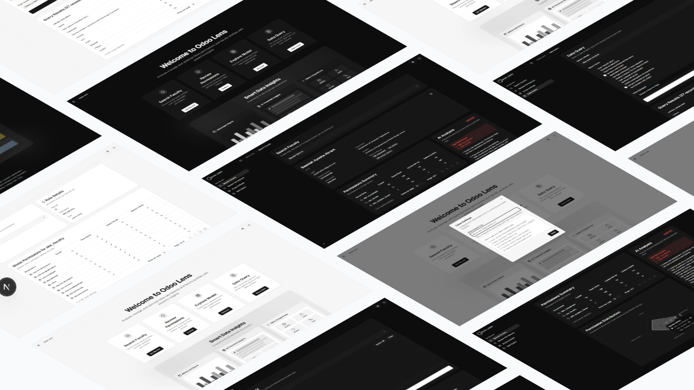
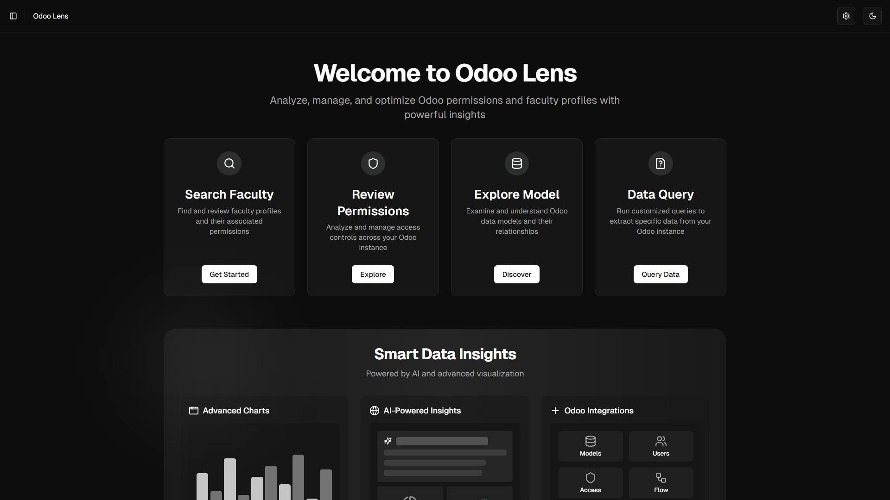
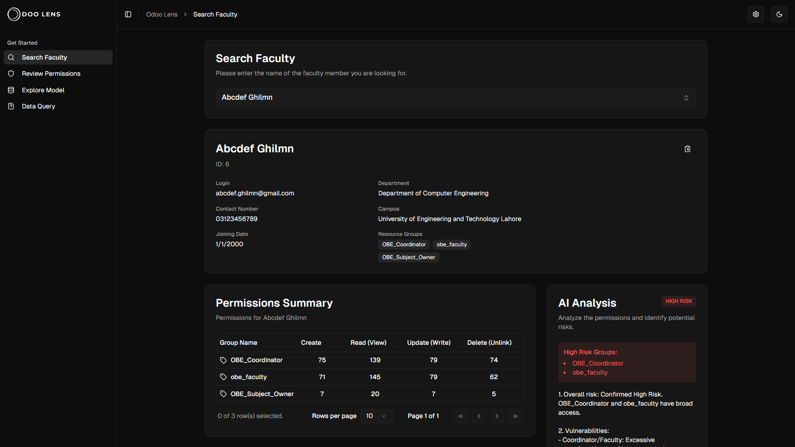
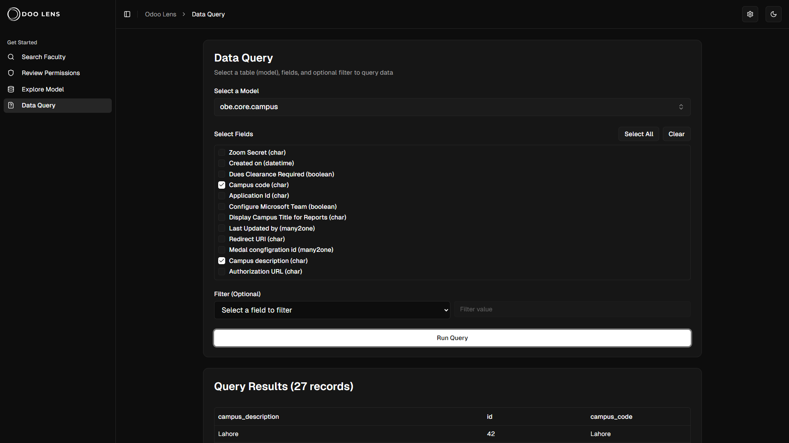
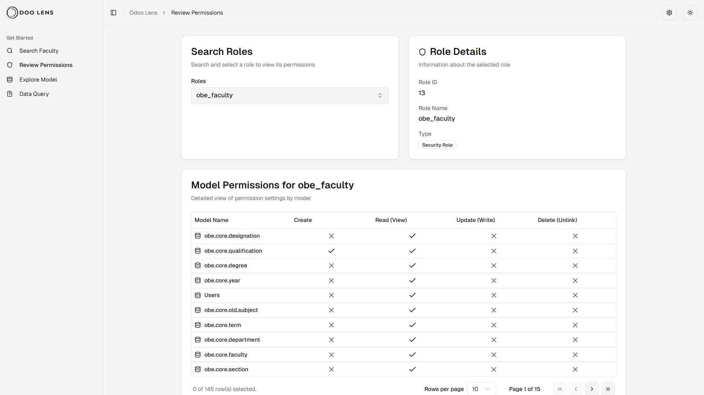

<p align="center">
    
</p>



Odoo Lens is a modern web application built to provide enhanced analytics, searching and management capabilities for Odoo ERP systems. It offers a set of powerful tools for exploring Odoo data models, analyzing permissions, querying data, and searching faculty information.

## Features

- **Model Exploration**: Visualize and explore Odoo data models and their relationships
- **Permission Analysis**: Review and analyze user permissions across the Odoo system
- **Data Query**: Execute and visualize custom queries against Odoo data
- **Faculty Search**: Advanced search and analytics for faculty members
- **AI-Powered Analysis**: Integration with Google's Generative AI for enhanced insights

## Tech Stack

- **Framework**: [Next.js 15](https://nextjs.org/) with TypeScript
- **Styling**: [Tailwind CSS](https://tailwindcss.com/)
- **UI Components**: Radix UI primitives
- **State Management**: React hooks with Context API
- **Data Visualization**: Recharts
- **AI Integration**: Google Generative AI (@google/genai)

## Screenshots

<details>
<summary>View screenshots</summary>






</details>

## Getting Started

### Prerequisites

- Node.js 18+
- npm or yarn
- Access to an Odoo instance (for full functionality)

### Installation

1. Clone the repository:

   ```bash
   git clone https://github.com/yourusername/odoo-lens.git
   cd odoo-lens
   ```

2. Install dependencies:

   ```bash
   npm install
   ```

3. Copy `.env.example` to `.env.local` and update with your configuration:

   ```bash
   cp .env.example .env.local
   ```

4. Start the development server:

   ```bash
   npm run dev
   ```

5. Open [http://localhost:3000](http://localhost:3000) in your browser

## Project Structure

```
src/
  app/               # Next.js app directory (pages and API routes)
  components/        # React components
  data/              # Static data files
  hooks/             # Custom React hooks
  lib/               # Utility functions and constants
  types/             # TypeScript type definitions
```

## Development

- **Development Server**: `npm run dev`
- **Build for Production**: `npm run build`
- **Start Production Server**: `npm run start`
- **Linting**: `npm run lint`

## Deployment

The application can be deployed on any platform that supports Next.js applications. Vercel is recommended for the easiest deployment experience:

1. Push your code to a Git repository
2. Import the project in Vercel
3. Configure environment variables
4. Deploy

## Contributing

1. Fork the repository
2. Create a feature branch: `git checkout -b feature/amazing-feature`
3. Commit your changes: `git commit -m 'Add amazing feature'`
4. Push to the branch: `git push origin feature/amazing-feature`
5. Open a pull request

## License

This project is licensed under the MIT License - see the LICENSE file for details.

## Acknowledgments

- [Next.js](https://nextjs.org/) - The React framework
- [Tailwind CSS](https://tailwindcss.com/) - Utility-first CSS framework
- [Radix UI](https://www.radix-ui.com/) - Unstyled, accessible UI components
- [Recharts](https://recharts.org/) - Charting library for React

---

Developed as part of IS-LAB course at UET (Spring 2025)
